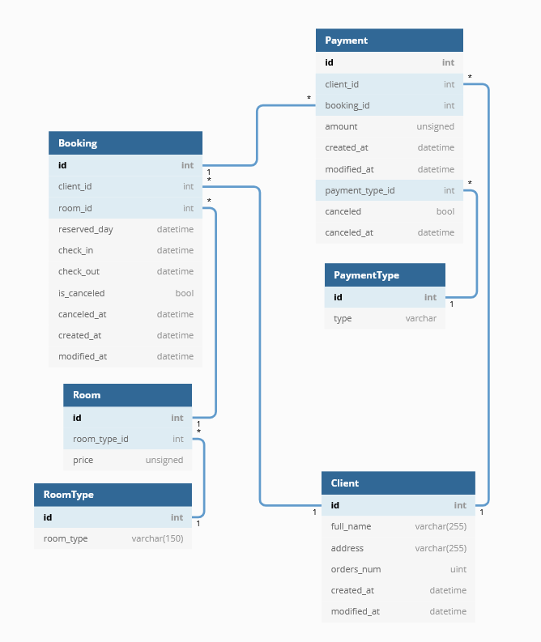

# .NetUniversityCourse
Solutions for .Net course by Konstantin Peshekhonov(@PeshekhonovK) in LETI
Main file to run tasks [here](TestTasks/RunTasks.cs)
# Test Tasks:
1) Implement linked list: (add, delete elements, reverse list) (Done :heavy_check_mark:) [here](TestTasks/LinkedList.cs)
2) Implement binary tree: (add element, delete element, search in tree) (Done :heavy_check_mark:)[here](TestTasks/BinaryTree.cs)
3) Implement insertion sort (Done :heavy_check_mark:)[here](TestTasks/Sort.cs)
# Task 1:
1) Implement Domain model:
* Subject : Hotel
* DB architecture:

* Classes:
    * [Payment](WebApp.Domain/Payment.cs)
    * [PaymentType](WebApp.Domain/PaymentType.cs)
    * [Client](WebApp.Domain/Client.cs)
    * [Booking](WebApp.Domain/Booking.cs)
    * [Room](WebApp.Domain/Room.cs)
    * [RoomType](WebApp.Domain/RoomType.cs)